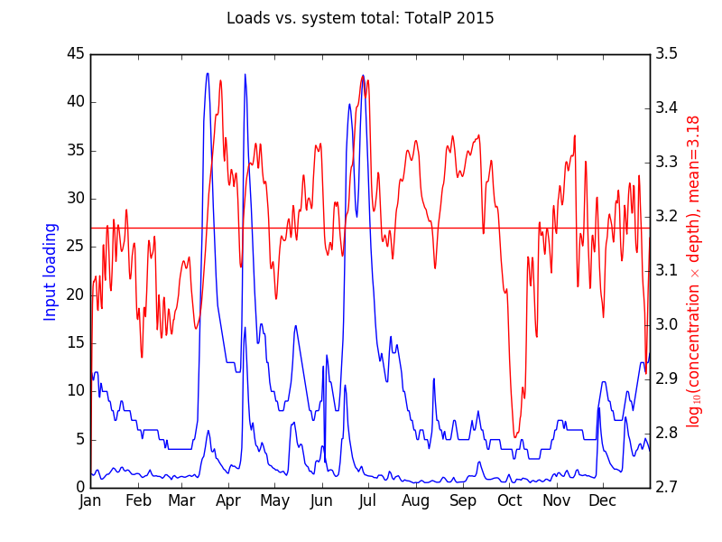
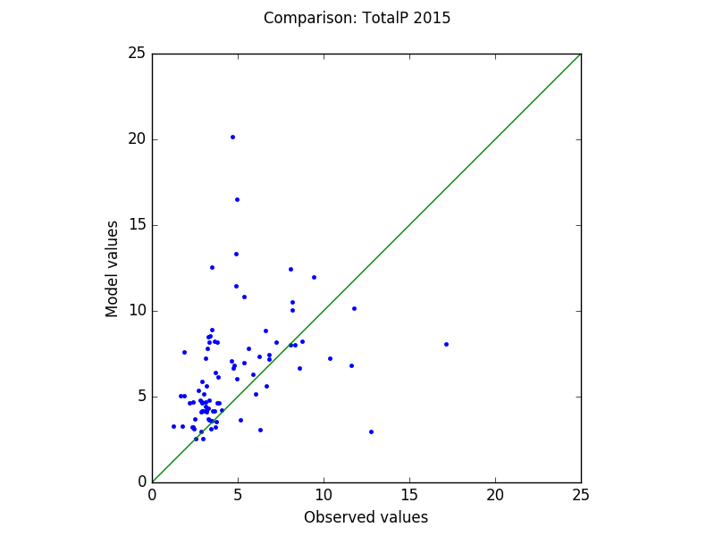

# Nested Nearshore Nutrient Model (N3M) <!-- .slide: data-state="hide-head" -->

<!-- .slide: data-background="img/front.png" data-background-size="contain" -->

<!-- 

### Terry Brown, James Pauer, Tom Hollenhorst USEPA MED

<http://tbnorth.github.io/nnnmp0iaglr>
-->

# Goals

 - Look at movement of nutrients in near shore
 - Examine influence on algal blooms (large scale / 
   long term)
 - Look at impacts of land use decisions

# Motivation

## Harmful Algal Blooms

 - Public health
 - Environmental impact
 - Economic impact
 - Recreational impact

## One dimensional nearshore model

 - Simplified view of nearshore as “conveyor belt” shuffling
   inputs back and forth
   - Also clumping and dispersing
 - Flow to/from deeper lake localized exception rather than
   common occurence
 - Contributions from different tributaries
 - Regional / seasonal dynamics, bloom or dispersion?

# GLAHF regions <!-- .slide: data-state="hide-head" -->

<!-- .slide: data-background="img/glahf_regions.png" data-background-size="contain" -->

# Study site <!-- .slide: data-state="hide-head" -->

<!-- .slide: data-background="img/21Mar2017Sentinel.png" data-background-size="contain" -->

# Study site <!-- .slide: data-state="hide-head" -->

<!-- .slide: data-background="img/sitemap2.png" data-background-size="contain" -->

# Inputs

## Flow

 - NOAA POM 2km 1 hour model
 - Available for 2006 - 2017
 - Depth
 - m/s south to north and west to east
 - Currently using vertically integrated 2d version

## Loadings

 - currently directly proportinal to flow
 - may acquire watershed specific model output
 
 <!-- .element width="50%" -->

# Observations  <!-- .slide: data-state="hide-head" -->

<!-- .slide: data-background="img/map_obs_flat2.png" data-background-size="contain" -->

# Model

$V_j\frac{dC_j}{dt} = \sum^n_iQ_i{}_jC_i{}_j + \sum^n_iR_i{}_j(C_i-C_j)+W_j-S_j$

 - Flow between cells
 - Diffusion between cells
 - Input into cells (from tributaries)
 - Settling term

## Viz pic <!-- .slide: data-state="hide-head" -->

<!-- .slide: data-background="img/model_gen.png" data-background-size="contain" -->

## Structure <!-- .slide: data-state="hide-head" -->

<iframe src="https://www.youtube.com/embed/AJpi2ShsUfg?rel=0&amp;controls=0&amp;showinfo=0?ecver=2" width="480" height="360" frameborder="0" style="position:absolute;width:100%;height:100%;left:0" allowfullscreen></iframe>

## Agents

 - Virtual drifters
 - Placed randomly across model
 - Put back in initial position when they drift
   out of the model
 - Placing them in new positions would cause clumping
   in slow moving parts of the model

## Implementation

 - Originally in MatLab, now in Python
 - Hybrid cell / agent model
 - Uses `multiprocessing` (true parallelism) for agents, flow,
   and reading inputs
     - Not a great boost with current test grid, but should help with
       larger grids

## Persistent multi-processing

 - `threading` `Queue` can be `joined()` to wait for all tasks to complete
 - `multiprocessing` `Queue` cannot, and a `Pool` must be closed before joining
 - Workers far too expensive to start every iteration
 - Use two `Queue`s, one to deliver tasks, and one to ping back when a task
   completes

# Visualization

 - Uses CesiumJS, an in-browser accelerated graphics (WebGL) framework
 - Spatial relationships clear (adjacency, etc.)
 - Relative flow speeds
 - Sattelite observations

## Interface <!-- .slide: data-state="hide-head" -->

<iframe src="https://www.youtube.com/embed/ihdx9SCcS5Q?rel=0&amp;showinfo=0?ecver=2" width="480" height="360" frameborder="0" style="position:absolute;width:100%;height:100%;left:0" allowfullscreen></iframe>

<!--

 - 3d environment
 - change displayed value
 - time control
 - interrogate items
 - satellite data

-->

# Results

## Extraction <!-- .slide: data-state="hide-head" -->

<!-- .slide: data-background="img/resultextract.png" data-background-size="contain" -->

## Pre-preliminary

 <!-- .element width="60%" -->

## Agents <!-- .slide: data-state="hide-head" -->

<iframe src="https://www.youtube.com/embed/AJpi2ShsUfg?rel=0&amp;controls=0&amp;showinfo=0?ecver=2" width="480" height="360" frameborder="0" style="position:absolute;width:100%;height:100%;left:0" allowfullscreen></iframe>

# Acknowledgements

 - Wilson Melendez, data preparation
 - Xiaomi Zhang, model development
 - Dave Griesmer, input collection
 - MED, GLNPO, NOAA, field observations

# Contact

Terry Brown

Brown.TerryN@epa.gov

James Pauer

Pauer.James@epa.gov

